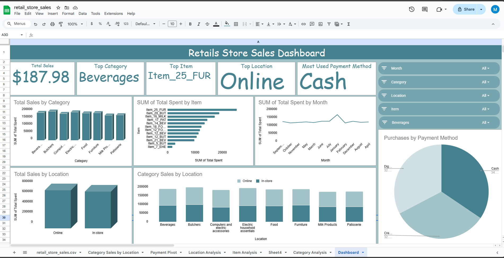

# Retail Store Sales Analysis 📊

## Project Overview
This project analyzes retail store sales data to identify top-performing products, categories, locations, and payment methods.  
An interactive dashboard was built using Google Sheets.

## Business Questions
- Which product categories generate the highest sales?
- Which items contribute most to revenue?
- How do online and in-store sales compare?
- What payment methods are most used?
- How do sales trends vary by month?

## Tools Used
- Google Sheets
- Pivot Tables
- Slicers & Filters
- Data Visualization

## Key Insights
- Online sales slightly outperform in-store sales across most categories.
- Beverages is the top-selling category.
- Item_25_FUR generates the highest total sales.
- Cash is the most used payment method.

## Dashboard Preview

